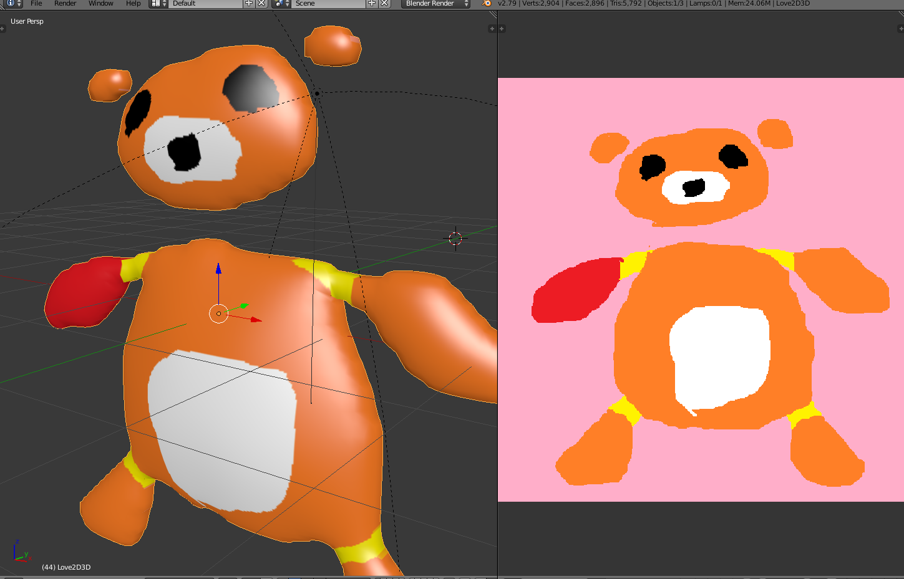
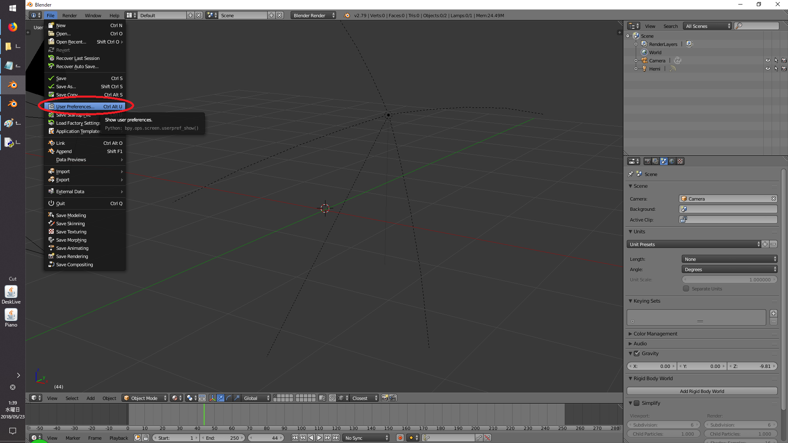
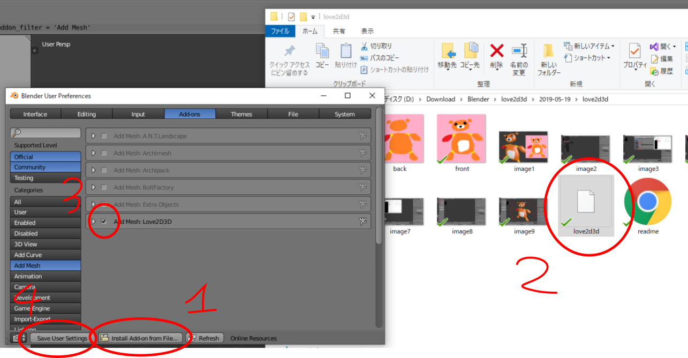
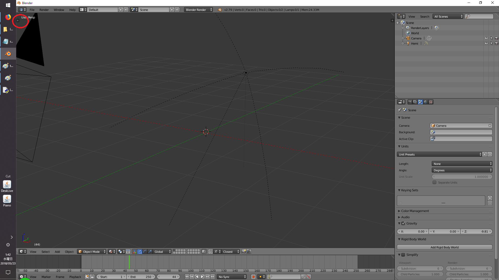
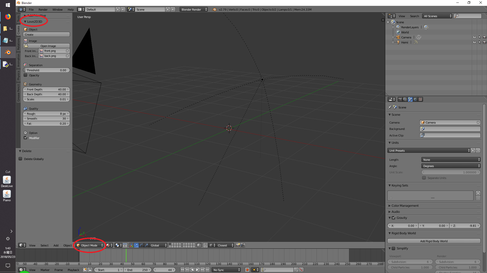
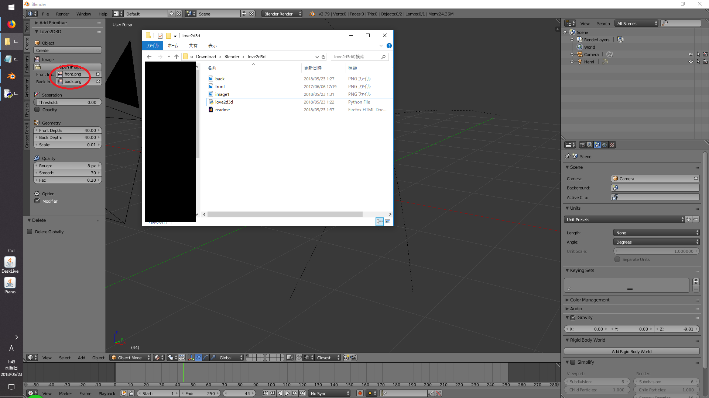
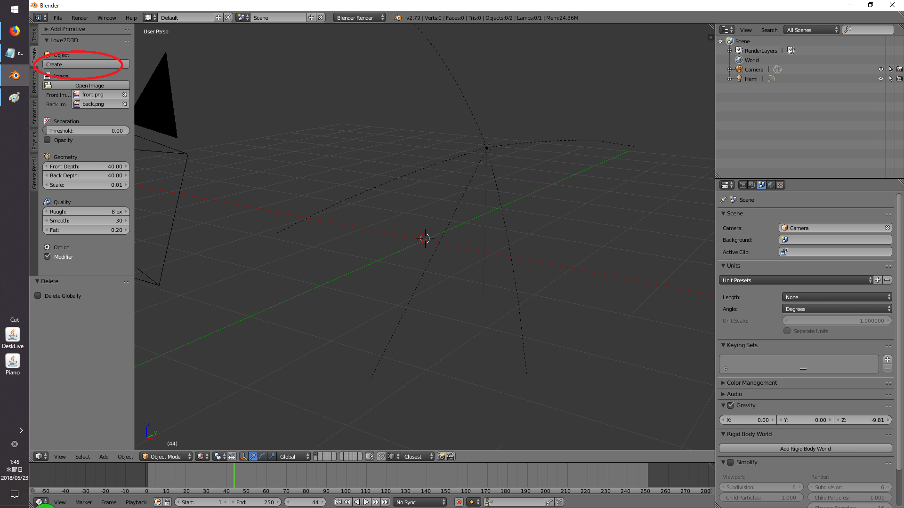
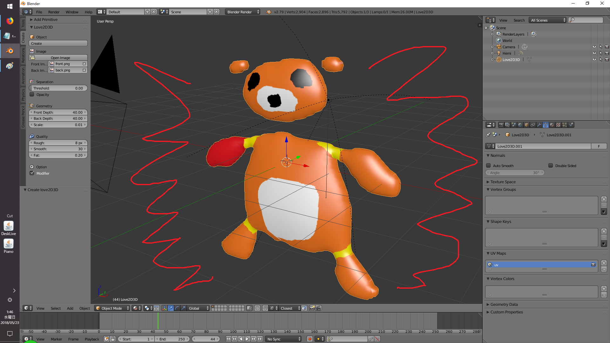

# What is this?
Blender addon to create 3D object from 2D image.  
You can use with usual paint tool and build 3D object with Blender!
[Let's try](https://github.com/rn9dfj3/love2d3d/releases)  
[More information](https://github.com/rn9dfj3/love2d3d/wiki)

# How to use

  
