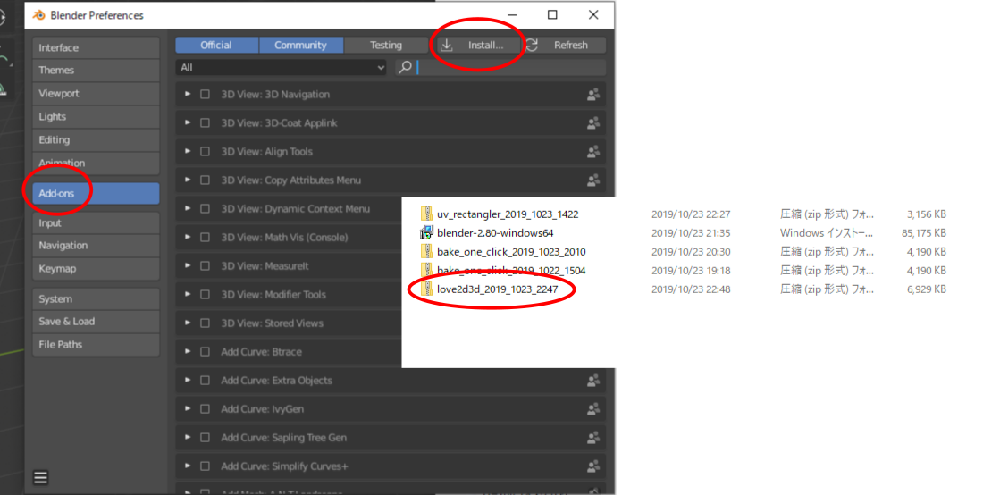

# Old version
The files in github is old vaersion.  
You can get the latest from [BOOTH](https://fujisunflower.booth.pm/items/1333674)  
Githubにあるファイルは古いバージョンです。  
最新版は[BOOTH](https://fujisunflower.booth.pm/items/1333674)  から入手出来ます。  
# Love2D3D
Blender addon to create 3D object from 2D image.  
You can use usual paint tool for the creation.  
The addon can create armature (bone) for 3D object.  
[YouTube](https://youtu.be/hdJOKAm-ZE0), [BOOTH](https://fujisunflower.booth.pm/items/1333674) or [wiki](https://github.com/FujiSunflower/love2d3d/wiki)    
画像から3Dモデルを作成するBlenderのアドオンです。  
使い慣れたペイントツールで描いた絵を立体化出来ます。  
3Dモデルを動かすために必要なボーンの生成も出来るようになりました。  
[YouTube](https://youtu.be/hdJOKAm-ZE0)・[BOOTH](https://fujisunflower.booth.pm/items/1333674)
・[詳細情報](https://github.com/FujiSunflower/love2d3d/wiki)  
  
# How to use
  
  
  
  
  
  
  
  
  
  
  
  
  
  
